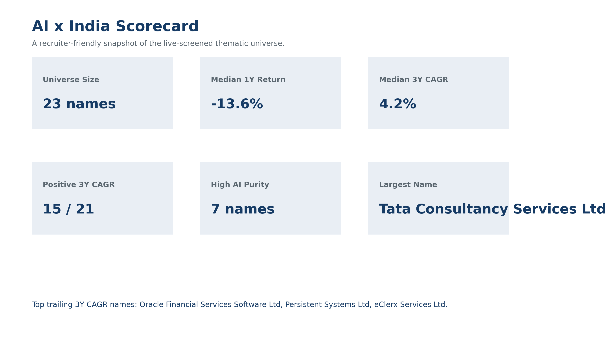
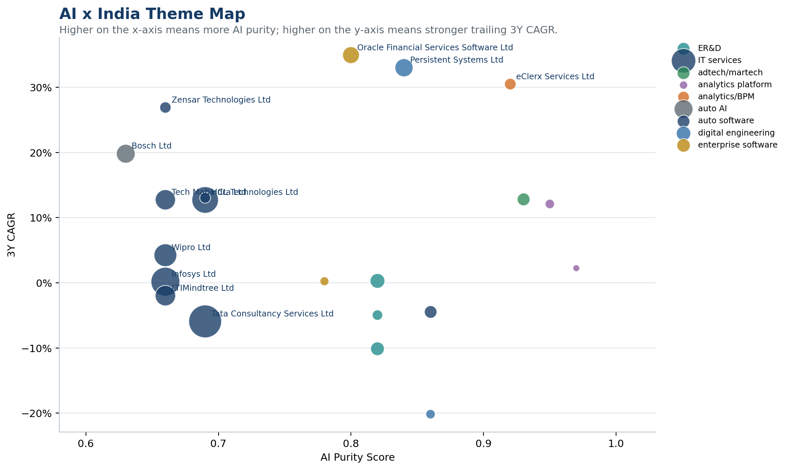

# AI x India: Thematic Pitch + Advisor Idea Engine

This repository contains two production-style work samples aimed at a 2026 Morgan Stanley Wealth Management / Investment Banking audience:

1. A thematic investment-banking / wealth pitch on `AI x India`
2. An AI-augmented idea engine prototype for wealth advisors

The repo is designed to feel like a realistic internal work sample rather than a toy notebook. It uses a curated universe of real listed Indian AI, analytics, ER&D, enterprise-software, and IT-services names, then pulls price history and basic fundamentals at runtime from public market-data sources.

## What is included

- `notebooks/01_ai_india_landscape.ipynb`
  Builds the thematic pitch: live performance, valuation, ranking tables, representative charts, and a slide-ready markdown deck.
- `notebooks/02_ai_idea_engine.ipynb`
  Builds a deterministic scoring engine for multiple wealth-client archetypes and exports an internal memo for advisor use.
- `src/data_loader.py`
  Public market-data utilities, including yfinance handling, a community Indian market API attempt, and REST fallbacks.
- `src/analysis.py`
  Shared analytics pipeline for trailing returns, volatility, drawdowns, charts, and hypothetical deal ideas.
- `src/scoring.py`
  Factor normalization, AI-purity logic, archetype weighting, and rationale generation.
- `src/reporting.py`
  Markdown export helpers for slide-ready pitch output and internal notes.
- `src/app.py`
  Streamlit front end for the advisor idea engine.
- `src/visuals.py`
  Saved chart, scorecard, heatmap, and HTML visual generation.
- `reports/ai_india_thematic_pitch.md`
  Generated thematic pitch output.
- `reports/ai_idea_engine_notes.md`
  Generated idea-engine notes.
- `reports/ai_india_visual_summary.md`
  Generated visual gallery with static charts and interactive HTML links.

## Visual gallery

The repo now includes saved visuals in `reports/figures/` so the work sample is easy to skim without opening notebooks.

The visual pack includes:

- indexed performance versus the NIFTY 50
- full-universe 1Y return distribution
- AI-purity theme map
- risk / return bubble chart
- segment market-cap chart
- cross-archetype idea-engine heatmap
- one-page scorecard graphic

Open `reports/ai_india_visual_summary.md` after generating the figures for a quick visual walkthrough.





## Universe design

The stock universe in `data/ai_india_universe.csv` is curated from public "AI stocks in India" lists and market commentary used only as guidance for company selection, including sources such as Bajaj Finserv, Smallcase, Motilal Oswal, and INDmoney. The repo does not scrape or copy those write-ups.

The universe intentionally mixes:

- Large-cap IT enablers: `TCS`, `Infosys`, `HCL Tech`, `Wipro`, `Tech Mahindra`, `LTIMindtree`
- ER&D / digital-engineering specialists: `Tata Elxsi`, `LTTS`, `Persistent`, `Cyient`, `Tata Technologies`
- Analytics / platform / AI-adjacent names: `Affle`, `Saksoft`, `RateGain`, `eClerx`, `Netweb`, `Oracle Financial Services Software`, `Bosch`, `KPIT`

## Data sources and limitations

All numeric market data in the analysis is retrieved at runtime. Nothing in the repo hard-codes prices, returns, or valuation metrics.

Primary source:

- `yfinance` / Yahoo Finance for Indian tickers and basic fundamentals

Fallback behavior:

- `src/data_loader.py` first attempts a community-hosted Indian Stock Market API endpoint via REST
- If that community deployment is unavailable or does not expose usable historical candles, the loader degrades gracefully to the Yahoo Finance chart REST endpoint

Important limitations:

- The static universe list is curated manually, but all performance and valuation outputs are calculated from live data at runtime.
- Macro statements in the pitch are prose summaries paraphrased from public research and press, not model inputs.
- This is an educational prototype and not investment advice.
- In a real Morgan Stanley environment, market data would come from licensed and permissioned sources such as authorized NSE/BSE vendors, GFDL, TrueData, or internal systems, not public APIs or `yfinance`.

Public macro context referenced in the thematic materials includes:

- [IBEF - IT & BPM Industry in India](https://www.ibef.org/industry/information-technology-india)
- [PwC India - Navigating the value shift](https://www.pwc.in/press-releases/2025/domains-driven-by-human-and-industrial-needs-can-unlock-usd-982-trillion-in-growth-opportunities-by-2035-pwc-india-report.html)

## Setup

Python 3.11+ is recommended.

```powershell
python -m venv .venv
.venv\Scripts\Activate.ps1
pip install -r requirements.txt
```

If you are using the same Anaconda interpreter as this build:

```powershell
& 'C:\Users\Anklesh\anaconda3\python.exe' -m pip install -r requirements.txt
```

## Usage

Launch Jupyter and run the notebooks top-to-bottom:

```powershell
jupyter lab
```

or

```powershell
jupyter notebook
```

Then open:

1. `notebooks/01_ai_india_landscape.ipynb`
2. `notebooks/02_ai_idea_engine.ipynb`

Running all cells will:

- pull live public-market data
- compute returns, volatility, drawdowns, and basic valuation fields
- refresh `reports/ai_india_thematic_pitch.md`
- refresh `reports/ai_idea_engine_notes.md`
- refresh the optional local cache `data/ai_india_stats_latest.csv`

Generate the saved visual pack:

```powershell
& 'C:\Users\Anklesh\anaconda3\python.exe' src\visuals.py
```

That command writes PNG and HTML artifacts into `reports/figures/` plus a gallery page at `reports/ai_india_visual_summary.md`.

Run the Streamlit app:

```powershell
streamlit run src/app.py
```

The app allows an advisor to:

- choose a client archetype
- adjust factor weights for growth, momentum, volatility, yield, and AI purity
- view the top-ranked AI x India ideas with rationale text tied to live metrics

## Folder structure

- `data/`
  Curated static universe file; runtime-generated caches are written here and ignored by Git.
- `notebooks/`
  End-user analysis notebooks for the thematic pitch and advisor engine.
- `src/`
  Reusable Python modules for data, analysis, scoring, reporting, visuals, and the Streamlit app.
- `reports/`
  Generated markdown outputs and figure artifacts that can be reused as deck notes or briefing material.

## Verification completed in this build

The repo was validated locally by:

- importing all modules successfully
- running the analytics pipeline end to end against live public data
- generating both markdown reports
- executing both notebooks via `jupyter nbconvert --execute` into `tmp/`

## Disclaimer

This repository is for educational and portfolio-use purposes only. It is not investment advice, not a research product, and not affiliated with Morgan Stanley.
