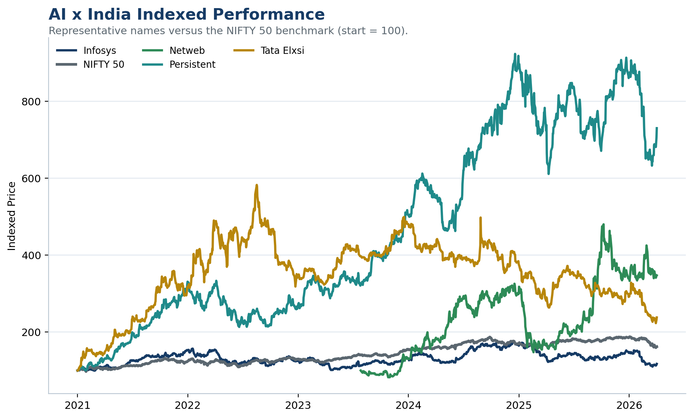
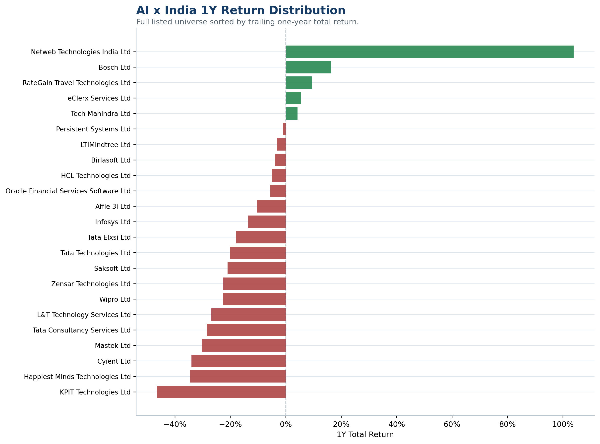
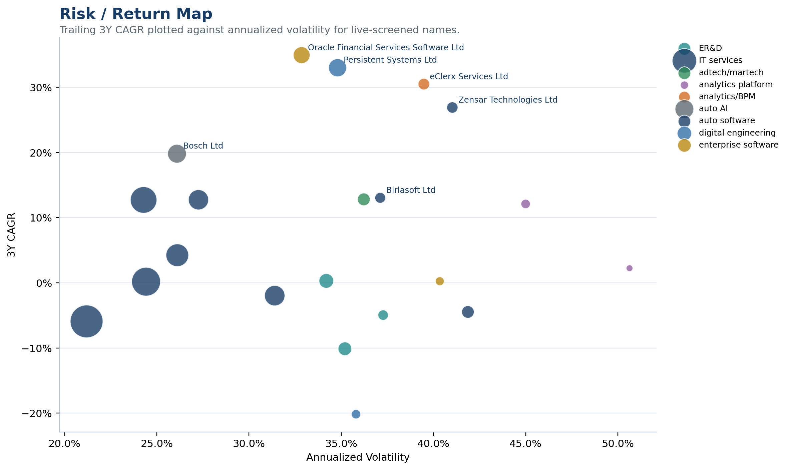
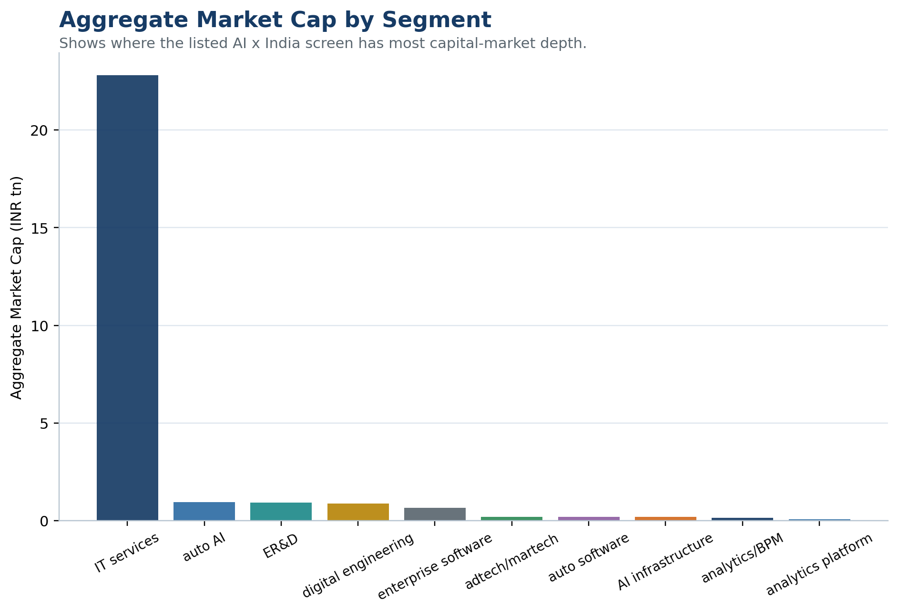
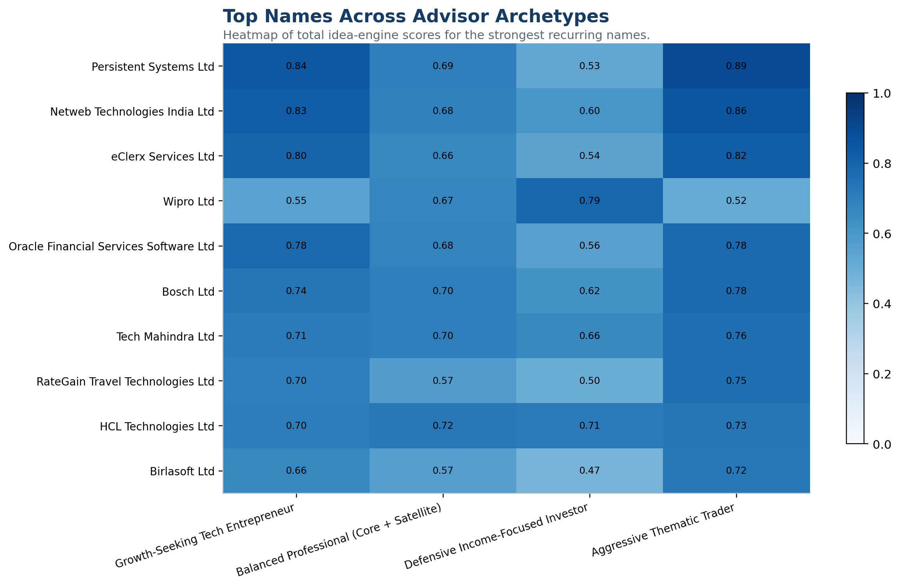

# AI x India Visual Summary

_As of 2026-04-04. Static visuals are generated from live public-market data and saved for recruiter-friendly review._

## Key Stats
- Universe size: 23 names
- Median 1Y return: -13.6%
- Median 3Y CAGR: 4.2%
- Top 3 trailing 3Y CAGR names: Oracle Financial Services Software Ltd (34.9%), Persistent Systems Ltd (33.0%), eClerx Services Ltd (30.5%)
- Highest AI-purity names: Netweb Technologies India Ltd (1.00), Saksoft Ltd (0.97), RateGain Travel Technologies Ltd (0.95)

## Visual Pack
### Scorecard

### Indexed Performance

### 1Y Return Distribution

### Theme Map

### Risk / Return Map

### Segment Market-Cap View

### Archetype Heatmap

## Interactive Files
- Indexed performance HTML: `ai_india_indexed_performance.html`
- Theme map HTML: `ai_india_theme_map.html`

